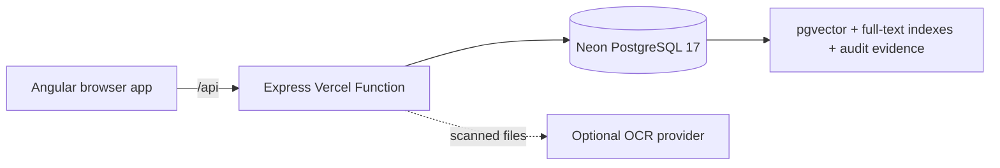

# Hackathon Knowledge

A minimal enterprise-knowledge proof of concept built from the Hackathon Framework. It keeps the generic document workflow available as an API compatibility layer while centering the product experience on permission-aware retrieval, policy evidence, and evaluation.

## Customization boundary

The primary navigation keeps the framework's Home, Query, Results, and Library links. A divider marks where the enterprise-knowledge workflow begins:

- **Home** summarizes the live corpus, identity boundaries, policy coverage, runtime profile, and latest evaluation evidence.
- **Secure Ask** runs the same-question/different-permission demo against server-resolved identities.
- **Access Rules** replays the deny-by-default classification and subsidiary policy against live database rows.
- **Evaluation** runs and persists the permission, context-isolation, and citation-integrity gates.

The generic framework behavior remains available, while `/api/v1/workspace/*` owns the permission-aware knowledge workflow.

## Included

- Angular 21 standalone frontend with framework and enterprise-knowledge navigation separated by a divider
- Knowledge-specific Home widgets backed by the live enterprise corpus and evaluation state
- Tenant-scoped department directory with database-enforced user-to-department membership
- Query, Results, and Library workflows retained from the reusable framework
- Express API packaged as a Vercel Function under `/api`
- PostgreSQL migrations with workspace scoping, full-text search, `vector(1024)`, and HNSW indexing
- Dependency-free feature-hash embeddings, so retrieval works before an external embedding provider is added
- Optional Claude OCR for scanned PDFs and images
- Server-owned demo identities with role, department, and subsidiary boundaries
- Permission-aware SQL pre-filtering before lexical or vector ranking
- Exact Vietnamese policy text and metadata from the supplied synthetic participant workbook
- The workbook's 32 canonical users, 40 documents, eight departments, and 50 public evaluation rows
- Citations, append-only audit evidence, and persisted evaluation runs
- Reproducible 50-row public evaluation and T1–T8 permission gates
- COP-compatible My Tasco staff and organization facade, OpenAPI contract, REST examples, and Dart adapter

## Architecture



The starter deliberately keeps the first deployment small:

- Raw files up to 4 MB are stored in PostgreSQL `bytea`, which stays under Vercel's request-body ceiling and avoids adding object storage to the baseline.
- Text, Markdown, CSV, JSON, HTML, and text-bearing PDFs process without an AI key.
- Scanned PDFs and images move to `needs_ocr` until `ANTHROPIC_API_KEY` is configured.
- Summaries are deterministic and embeddings use local feature hashing. Replace these services with challenge-specific models without changing the database or API contracts.

For enterprise-knowledge queries, the API resolves the supplied demo user ID against the server-owned user table. Subsidiary, classification, role, and department predicates run in SQL before lexical or vector ranking. Only authorized chunks can enter deterministic answer construction or optional model context.

The 40 canonical knowledge sources preserve the Vietnamese `content_vi` and document metadata from `ai_workspace_dataset_vietnamese_participants.xlsm`. A separately labelled 41st source and persona exist only to demonstrate cross-subsidiary isolation; they are never represented as challenge-provided data. The participant workbook itself states that all records are synthetic.

For a production-sized corpus, move raw objects to S3 or Vercel Blob, upload directly with signed URLs, and keep only metadata, extracted text, chunks, and vectors in PostgreSQL.

## Local run

Prerequisites: Node.js 22+ and pnpm 9. Docker is optional when using the checked-in local PostgreSQL fallback.

Copy the local environment template, provide a Neon connection string, then migrate and seed:

```sh
pnpm install
cp apps/api/.env.example apps/api/.env
pnpm db:migrate
pnpm db:seed
pnpm dev
```

- Web: `http://localhost:4200`
- API health: `http://localhost:3333/api/health`
- Secure API meta: `http://localhost:3333/api/v1/meta`
- My Tasco facade health: `http://localhost:3333/mytasco/v1/health` (requires `X-App-Code: MYTASCO`)

## Neon PostgreSQL 17

The local checkout is associated with a free Neon project through `.neon`; that file contains only the project ID. Credentials stay in the ignored `apps/api/.env` file.

1. Authenticate with `npx neonctl@latest auth`.
2. Create or select a PostgreSQL 17 project in `aws-ap-southeast-1`.
3. Store its pooled connection string in `apps/api/.env` as `DATABASE_URL`.
4. Keep `PGSSLMODE=verify-full` and `PG_POOL_MAX=5` for verified serverless TLS.
5. Run `pnpm db:migrate`, `pnpm db:seed`, and `pnpm verify:knowledge`.

The Vercel function is pinned to Singapore (`sin1`) to stay close to the Neon project.

## Vercel deployment

Import this repository as one Vercel project with the repository root as the project root. The checked-in configuration:

- installs the pnpm workspace;
- builds the Angular browser application;
- publishes `dist/web/browser`;
- deploys `api/index.js` as the Express function;
- preserves `/api/*` and `/mytasco/*` while rewriting other application routes to Angular's `index.html`.

Set these environment variables for Preview and Production:

| Variable | Required | Purpose |
| --- | --- | --- |
| `DATABASE_URL` | Yes | Neon pooled PostgreSQL connection string |
| `PGSSLMODE` | Yes | Use `verify-full` for Neon certificate and hostname verification |
| `PG_POOL_MAX` | No | Per-function pool size; defaults to 5 |
| `CORS_ORIGIN` | No | Only needed when the API is called from another origin |
| `ANTHROPIC_API_KEY` | No | Enables OCR for scanned PDFs and images |
| `ANTHROPIC_OCR_MODEL` | No | OCR-capable model override |
| `LLM_PROVIDER` | Bedrock use | Set to `bedrock` |
| `AWS_REGION` | Bedrock use | Bedrock region; configured as `us-east-1` |
| `AWS_ACCESS_KEY_ID` | Vercel Bedrock use | IAM access key stored as a Vercel secret |
| `AWS_SECRET_ACCESS_KEY` | Vercel Bedrock use | IAM secret key stored as a Vercel secret |
| `AWS_SESSION_TOKEN` | Temporary credentials only | Session token for temporary AWS credentials |
| `BEDROCK_MODEL_ID` | Bedrock use | Primary Claude model or inference-profile ID |
| `BEDROCK_CONTEXT_MAX_CHARS` | No | Maximum retrieved source text sent per query; defaults to 12,000 |
| `BEDROCK_LIGHTWEIGHT_MODEL_ID` | Bedrock use | Lightweight Claude model or inference-profile ID |
| `BEDROCK_EMBEDDING_MODEL_ID` | Bedrock use | Cohere embedding model ID |

Run migrations before opening the deployed application. Migrations are intentionally not executed during request startup or every Vercel build.

## API surface

| Method | Route | Purpose |
| --- | --- | --- |
| `GET` | `/api/health` | Database and vector contract health |
| `GET` | `/api/dashboard` | Workspace counts |
| `GET` | `/api/conversations` | Previous sessions |
| `GET` | `/api/conversations/:id` | Resume a session |
| `DELETE` | `/api/conversations/:id` | Delete a session and its messages |
| `POST` | `/api/query` | Search the corpus and store a grounded exchange |
| `GET` | `/api/library` | Current folder, breadcrumbs, child folders, and documents |
| `POST` | `/api/library/folders` | Create a folder in the current workspace location |
| `GET` | `/api/documents` | Corpus files and pipeline states |
| `POST` | `/api/documents` | Ingest one multipart file |
| `POST` | `/api/documents/:id/process` | Process or retry an ingested file |
| `DELETE` | `/api/documents/:id` | Remove a file and its chunks |
| `GET` | `/api/v1/meta` | Secure knowledge runtime and corpus counts |
| `GET` | `/api/v1/workspace/seed-world` | Safe demo identities, source metadata, and question prompts; no source answers |
| `POST` | `/api/v1/workspace/ask` | Permission-filtered grounded answer or refusal |
| `POST` | `/api/v1/workspace/ask/by-role` | Compare the same question across canonical personas |
| `GET` | `/api/v1/workspace/documents/:id` | Authorized source detail or denial evidence |
| `GET` | `/api/v1/workspace/search` | Permission-prefiltered hybrid retrieval |
| `POST` | `/api/v1/workspace/permission-test` | Run T1–T8 permission cases |
| `GET/POST` | `/api/v1/workspace/eval` | Run and optionally persist the 50-row evaluation |
| `GET` | `/api/v1/workspace/retrieval-trace` | Replay append-only audit evidence |
| `POST` | `/mytasco/v1/staff/search` | COP-compatible deterministic staff directory search |
| `POST` | `/mytasco/v1/staff/quick-search` | Staff autocomplete alias |
| `GET` | `/mytasco/v1/organization/tree` | COP-compatible organization and department hierarchy |

Generic framework data remains scoped with `x-workspace-id`. The secure API discards browser-supplied role, department, and subsidiary claims and resolves those attributes from the canonical database user.

The My Tasco facade requires `X-App-Code: MYTASCO`, echoes `X-Request-Id`, and uses the documented `{ status, message, body, requestId }` COP envelope. It is a deterministic mock: authentication is optional, while supplied Bearer tokens must use `demo-U001` through `demo-U032`. Production integration must replace those demo tokens with the My Tasco token provider.

Submission/integration artifacts:

- [`docs/openapi.yaml`](docs/openapi.yaml) — OpenAPI 3.1 contract
- [`docs/mytasco_client.dart`](docs/mytasco_client.dart) — configurable Dart adapter with one guarded 401 refresh retry
- [`docs/rest-examples.http`](docs/rest-examples.http) — staff, organization, search, answer, and refusal examples
- [`docs/demo-and-security.md`](docs/demo-and-security.md) — 10 grounded Q&A examples, eight permission cases, ACL enforcement, and data provenance

## Verification

```sh
pnpm build
pnpm verify:knowledge
```

The knowledge verification checks all 40 workbook-backed Vietnamese sources, exact leave-policy content, SQL-level Restricted denial, cross-subsidiary isolation, the same-question Employee/Executive flow, 50/50 public evaluation, T1–T8, zero permission leaks, zero Restricted context hits, and persisted audit evidence.

## Where to customize

- Brand and navigation: `apps/web/src/app/layout/app-shell.component.ts`
- Visual system: `apps/web/src/styles.css`
- Query/retrieval orchestration: `apps/api/src/services/chat_service.ts`
- Bedrock grounded generation: `apps/api/src/services/bedrock_llm_service.ts`
- Embeddings: `apps/api/src/services/vector_service.ts`
- Extraction and OCR: `apps/api/src/services/ingestion_service.ts`
- Database schema: `apps/api/src/db/migrations.ts`

## Production hardening checklist

- Replace the demo identity selector and `demo-U###` facade tokens with the production My Tasco Bearer-token provider and token-derived principal.
- Move large raw uploads to object storage with signed upload URLs.
- Add a durable queue for long-running OCR and indexing jobs.
- Add malware scanning, MIME signature validation, rate limits, and per-workspace quotas.
- Replace deterministic answer assembly with a grounded model call and preserve citations.
- Add automated migration, API, retrieval, and browser tests before public use.
